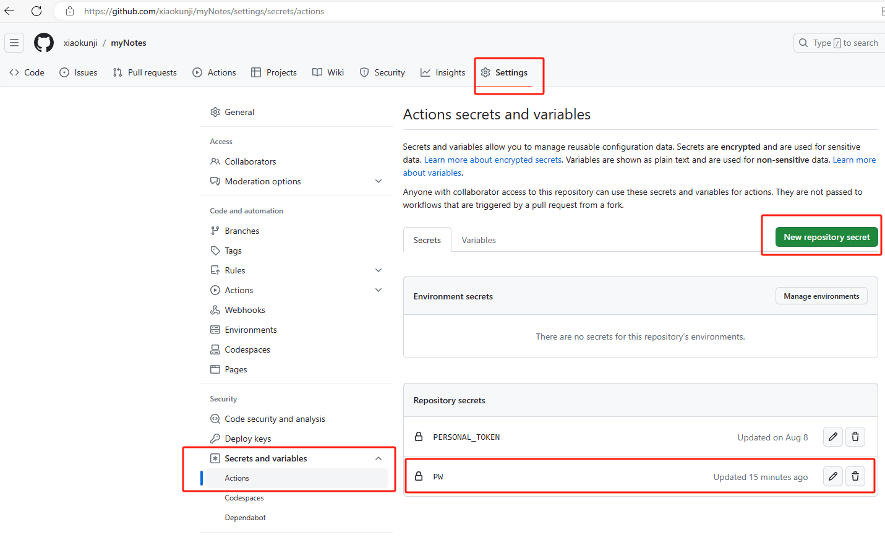

# Hugo Encryptor

**Hugo-Encryptor** 是一款能够帮助作者保护文章内容的工具。它使用 AES-256 来对文章的内容进行加密，并且通过在文章中嵌入内联 `JavaScript` 代码来验证读者输入的密码是否正确。没有正确的文章密码，读者将无法看到文章的加密内容。

[English Document](./README.md) 

[效果演示](https://0n0.fun/post/2019/03/this-is-hugo-encryptor/)

## 安装

环境依赖：Python3

### 步骤一：下载 Hugo-Encryptor 并安装其所需要的依赖库

    $ git clone https://github.com/Li4n0/hugo_encryptor.git
    $ cd hugo_encryptor
    $ chmod +x hugo_encryptor.py
    $ pip install -r requirements.txt

### 步骤二：复制js文件

把``decrypt.js` 复制到hugo的`static/js`目录下

### 步骤三：复制 `shortcodes/hugo-encryptor.html` 

`hugo-encryptor.html` 复制到hugo 的`\layouts\shortcodes` 目录下

### 步骤四：复制 python加密文件

把`hugo-encryptor.py` 文件复制到hugo的根目录下(和hugo的配置文件同一级目录)


## 使用方法

### 步骤一：使用 `hugo-encryptor` 标签包裹你需要加密的内容

1. 使用加密短代码

**注意：在 `hugo-encryptor` 标签之前必须存在一段明文文字以及 `<!--more-->`**

```markdown
---
title: "这是一篇加密文章"
---

**这里必须存在一些明文文字以及概要标签:**

<!--more-->

{}

# 这里是你要加密的内容!

这里是你要加密的内容!

**别忘了闭合 `hugo-encryptor` shortcode 标签:**

{}
```
2. 设置密码
    **方案一** (默认): 在github的action中加入密码, 如图
    
    优点: 密码是保密的,文章源码可暴露
    缺点: 全站密码统一(当然也可以自己多设置几个)
    
    
    
    **方案二** : 在加密文章的front matter 中加入 `password` 参数, 作为密码
优点: 可以为每篇文章设置密码
    缺点: 文章源码不能暴露, 因为密码就是源码中
    
    > 其实也可以在 front matter 中的密码放在github的actiong中, 这样方案一和方案二的优点就可以合并了
    
    
    
    **方案三**: 在使用短代码时, 传入参数
    优点: 可以给同一篇文章设置多个密码, 且可以不一样
    缺点: 文章源码不能暴露, 因为密码就是源码中

### 步骤二：像往常一样生成你的网站

    $ hugo

> 注意：在重新生成之前请先将你的 `public/` 删除，详见 [#15](https://github.com/Li4n0/hugo_encryptor/issues/15#issuecomment-826044272)。

### 步骤三：进行加密

    # 在hugo的根目录下执行
    python /absolute/path/to/hugo_encryptor/hugo_encryptor.py


## 配置

虽然 **Hugo-Encryptor** 可以在没有经过任何配置的情况下正常运行，但是我们提供了一些设置，来帮助用户将 **Hugo-Encryptor**按照自己的喜好进行配置

### 语言

在默认情况下，**Hugo-Encryptor** 用中文作为提示信息的输出语言，通过在博客的配置文件添加`hugoEncryptorLanguage` 参数，你可以将它改变为英文输出，就像下面这样：

```toml
[params]
 		 ......
  hugoEncryptorLanguage = "en-us" # or "zh-cn"
```

### 样式

在默认情况下，**Hugo-Encryptor** 没有任何样式，但是我们为每一个可见元素都提供了类名，方便用户自己在 css 文件中为他们添加样式

## 注意：

- ~~切记一定要保证你所加密的文章的源代码是私密的。永远不要把你的博客目录发布到一个公开的仓库~~

  > 把密码放在actions中就可以保证密码不会泄露

- 每当你生成你的站点，你都应该再一次执行`$ python hugo-encryptor` 命令来加密你想保护的文章。如果你担心你会忘记这一点，选择使用一个 shell 脚本来代替 `$ hugo` 命令是一个不错的选择，就像下面这样：

  ```bash
  #!/bin/bash
  hugo
  python hugo-encryptor.py
  ```

- 生成加密网页后, 可以在网站中查看"源代码",看自己加密的内容是不是被展示出来了,  有些主题会提前摘取文章内容, 可自行查看并去掉它

- 只能给markdown文章内容加密, 无法加在模版代码和目录中

